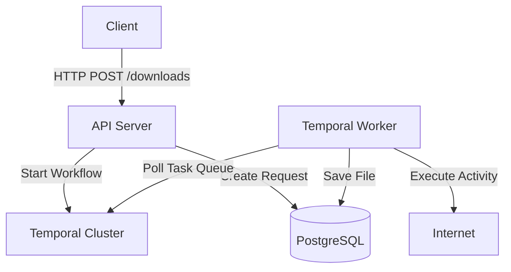

# Async File Downloader

An asynchronous file downloading service built with **Go**, **Temporal**, and **PostgreSQL**. This system allows users to submit a list of URLs to be downloaded in the background, tracks the status of the request, and provides access to the downloaded files.

## Features

- **Asynchronous Processing**: Uses Temporal workflows to manage resilient file downloads.
- **Reliable Storage**: Stores file metadata and content (as BLOB) in PostgreSQL.
- **REST API**: Clean API for submitting requests and checking status.
- **Retry Mechanism**: Automatically retries failed downloads with exponential backoff.
- **Scalable Architecture**: Decoupled API and Worker services.
- **Automatic Schema Creation**: The application initializes the database schema on startup.

## Tech Stack

- **Go** (1.25+)
- **Temporal** (Workflow Orchestration)
- **PostgreSQL** (Database)
- **Docker & Docker Compose**

## Architecture

The project follows a **Clean Architecture** approach:



## Configuration

Copy `.env.example` to `.env` and update values:

```
cp .env.example .env
```

`DB_URL` is used if present. If it is empty, the app builds the connection string from `DB_USER`, `DB_PASSWORD`, `DB_HOST`, `DB_PORT`, and `DB_NAME`.

## Run

Start infrastructure:

```
docker-compose up -d
```

Terminal 1: Temporal worker
```
go run ./cmd/worker
```

Terminal 2: API server
```
go run ./cmd/api
```

## API

### 1) Create download request

`POST /downloads`

Request body:
```json
{
  "files": [
    {"url": "https://google.com"},
    {"url": "https://www.w3.org/WAI/ER/tests/xhtml/testfiles/resources/pdf/dummy.pdf"}
  ],
  "timeout": "60s"
}
```

Response:
```json
{
  "id": 12,
  "status": "PROCESS"
}
```

### 2) Check request status

`GET /downloads/{id}`

Response (success):
```json
{
  "id": 12,
  "status": "DONE",
  "files": [
    {"url": "https://google.com", "file_id": 79},
    {"url": "https://www.w3.org/WAI/ER/tests/xhtml/testfiles/resources/pdf/dummy.pdf", "file_id": 80}
  ]
}
```

Response (partial errors):
```json
{
  "id": 12,
  "status": "DONE",
  "files": [
    {"url": "https://bad.host/file", "error": {"code": "DOWNLOAD_FAILED"}},
    {"url": "https://google.com", "file_id": 80}
  ]
}
```

### 3) Download file

`GET /downloads/{id}/files/{file_id}`

Response: binary stream with `Content-Type: application/octet-stream`.

## Tests

Run all tests:
```
go test ./...
```

Run only usecase tests:
```
go test ./internal/usecase_test
```

## Notes

- Request-level timeout is enforced for the entire download batch.
- If a file fails to download, the rest continue.
- Errors are stored per file as `TIMEOUT` or `DOWNLOAD_FAILED`.
